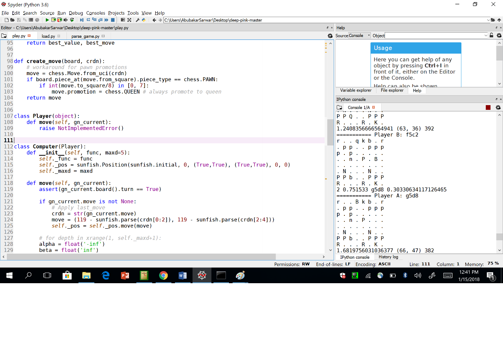
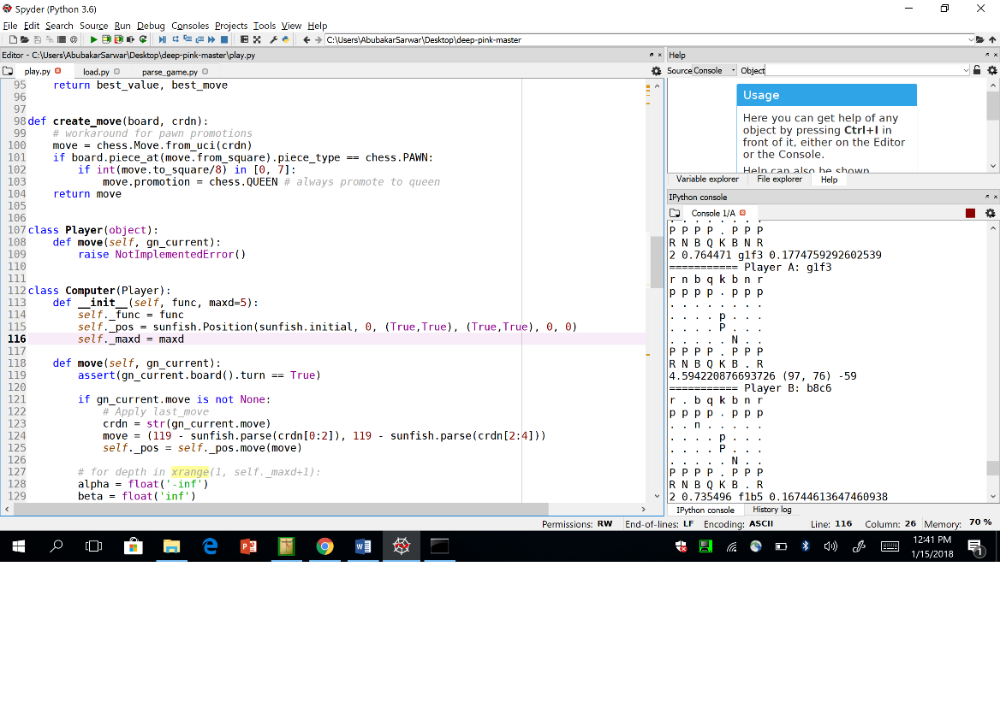
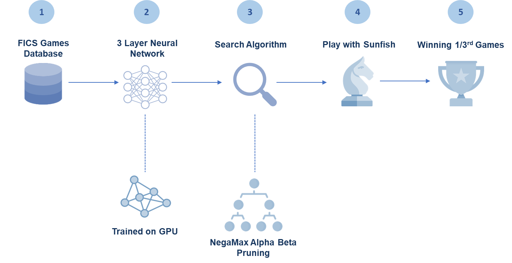
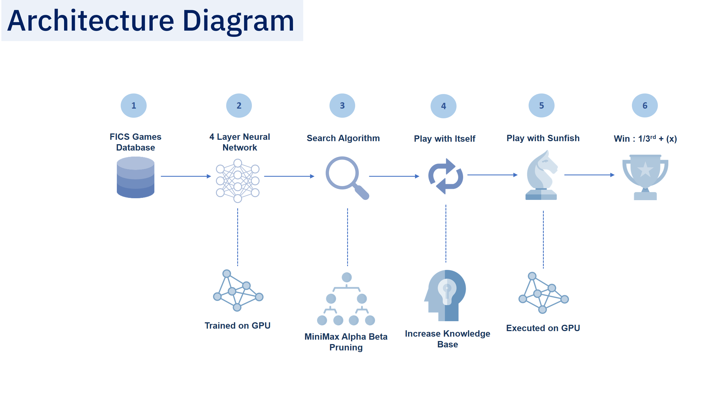

# DeepPink-Analysis

The following tasks were needed to be completed as a professional assesment test: 
1.	Download the chess AI source code from https://github.com/erikbern/deep-pink
2.	Compile and run the program, capture some screen shots of execution.
3.	Explain the flow of the program as a flowchart describe working of the code in a report format.
4.	See how you can train the program in your own way and describe about the approach.

1)	Download the chess AI source code from https://github.com/erikbern/deep-pink : Completed ✔

2)	Compile and run the program, capture some screen shots of execution: Completed ✔
Effort Required to make the code work:

•	Installed all the dependencies for Deep Pink (Such as Theano, SunFish etc)
•	Couldn't Install Cuda for Theano because my laptop doesn't have NVidia Graphic Card but then got to know that GPU is optional for Theano not compulsory. 
•	Had to rephrase the code in several portion to make the 2.7 version code work with my 3.6 version of python.
•	The following are few of the changes that were made in the code to make it run:
o	In the function 'get_model_from_pickle' from play.py, I had to change the 'read' parameter to 'read binary' as the new version requires the syntax 'rb' instead of 'r' when loading pickle. 
o	Even after that, I was getting an error for ASCII Decoding so I had to add encoding = 'latin1' to load the pickle model.   
o	The load.py file had a function xrange() which is deprecated now in the new version of python. So, I had to convert it from xrange() to range().
Screenshots: I used the Spyder IDE that comes with Anaconda, to execute the code play.py. The screenshots are given below: ¬

 
3.	Explain the flow of the program as a flowchart describe working of the code in a report format: Completed ✔
The Current Approach
Overview: 
Deep Pink itself is a deep learning based AI chess game created by Erik Bernhardsson.
 
Work Flow of the Approach:
1.	Retrieving the Dataset: A set of 100 M games downloaded from FICS Games Database. The source is the world’s largest chess database. It provides the games played on the Free Internet Chess Server. However, the game played are not only by chess experts. Therefore, it means we cannot totally rely over the results of these games. The dataset contains file pgn format which are like a text file and equal to all the moves made by the player in a particular game.

2.	Model Training: A 3 layer deep 2048 units wide artificial neural network. 

4.	Input: The total input is basically 8x8x12 array. So basically a 768-wide layer which is a way of identifying the presence of the 12 pieces in each square. After three multiplications, the final dot product is a 2048 wide vector.
5.	Layers: There are a total of 3 layers which means two convolutional and one fully connected layer because we know that there are no Drop out Layers in this model.
6.	Output: A single scalar value. 
7.	Duration: This model was trained on a GPU Instance from AWS which took about 4 days to train.
8.	Model.pickle: The trained version of the algorithm is saved in the Model.pickle file that is in the Github link.

3.	Ingesting Trained Model to Search Algorithm:  Once, the training of the model is completely. It is time to use the trained model as an Evaluation Function for the search algorithm that is being used. In our case, Deep Pink is using Negamax with alpha-beta pruning. The Negamax basically tackles the value of a position to player A in a way that it is the negation of the value to player B.  Morever, alpha-beta pruning is a variation of the algorithm that can decrease the number of nodes the negamax algorithm evaluates in a search tree. 

4.	How does it make a move? After the model has been ingested as the evaluation function. Now, every time Deep Pink must make a move. It will use the Negamax search algorithm to find the best possible next move for itself. And the way it will do it is that it will pass the input to the neural network and get the result in a single value that how this next move will affect the environment and chances of losing/winning for the player. This way, it will calculate a series of moves and see which is the best possible move for deep pink at that moment. In short, it is working proactively by calculating the impact of its current move on the future. 
Competitor: 
Sunfish, which is also an AI Chess engine created on python. This was used as a competitor of Sunfish to see how Deep Pink performs against another Chess engine. The chess engine resides inside the Sunfish.py file.
Results:
Sunfish is a better chess engine as it won 2/3 of the games played again Deep Pink. However, there are a set of reasons why SunFish was performing better than deep pink. I’ll try to tackle them when I’m giving my own approach.

Basic Flow of the Code:
1.	Execute Play.py to start the program
2.	It fetches the model.pickle to load the pre trained neural network model.
3.	It calls the game functions passing the model as the parameter
4.	The game function creates a chess board
5.	It sets the depth for Deep Pink from 1 to 2. This depth is the depth of the tree that will be used in the search algorithm.
6.	It sets the depth for SunFish.
7.	It creates an Object for Deep Pink using the Computer Class.
8.	It creates an Object for Sunfish using the SunFish Class.
9.	It sets the timer for both of the Players just to know about the time each player is taking in making every move.
10.	It Starts an infinite loop.
11.	Player calls the function Move, to perform a move.
12.	The move functions takes the current object.
13.	Alpha is set as float('-inf'), it acts as an unbounded lower value. 
14.	Beta is set as float('inf'), it acts as an unbounded upper value.
15.	The depth is set for the NegaMax Algorithm.
16.	The timer is reset to calculate the time of the move.
17.	After setting all the required parameters for NegaMax, the function for NegaMax is called to apply NegaMax Alpha Beta Pruning using the parameters (current position, depth, alpha, beta, function).
18.	 The NegaMax function calculates all the possible moves based on the max depth given.
19.	After that, it uses the function (pre trained model) to calculate scores for each one of them.
20.	Once the scores are calculated, it iterates over to find out the best possible move at this current position.
21.	The player makes the best possible move.
22.	Then it waits for SunFish to make a move.
23.	Once the move is made, it makes a series of checks(check mate, stalemate etc) to see if anyone of them is possible. If not, go back to step 11 (call move).
24.	This process is carried on until one of them wins. 

4.	See how you can train the program in your own way and describe about the approach: Completed ✔
My Own Approach
Assumption:
I must work on the same Dataset as Deep Pink is currently using now.
Overview: 
  
If I were to train Deep Pink on my own. The approach would also be a reinforcement learning approach including neural network. But to make it work better than the current approach I would change a series of a parameters as mentioned below: 
Work Flow of the Approach:
1.	Retrieving the Dataset: A set of 100 M games downloaded from FICS Games Database. It will be the same.

2.	Model Training: For the model, I would suggest a convolutional neural network. It is because chess boards are like an image because of their dimensional formatting. The model will consist of 4 layers. The single addition in layer than the previous approach is not for convolutional layer, it is to add a dropout layer. It will try to avoid overfitting. Drop out layer randomly drops neurons to make the model a little more randomize and generic so that the model doesn’t react much to noise. Therefore, the model will consist of 2 convolutional layers, 1 fully connected layer and 1 drop out layer. As of the input, I would prefer keeping it the same as the previous approach as the chess board size and number of pieces don’t really tend to vary that much.  The model should be trained over a GPU because with the number of layers we are tackling, it would take weeks or months to train it over a CPU.

3.	Ingesting Trained Model to Search Algorithm:  The trained model will be used as an Evaluation Function for the search algorithm that is being used. In my approach, I would prefer minimax alpha-beta pruning. There are 3 main reasons for this:

a.	Negamax and minimax might sound similar but Negamax sets the arguments alpha and beta for the root node to the lowest and highest values possible. On the other hand, minimax may initialize alpha and beta with alternate values to further improve tree search performance.
b.	Now, once we know minimax is better, we also know it is very complex. Therefore, to reduce the complexity and number of nodes, I am opting for the apha-beta pruning approach of Minimax.
c.	Lastly, Sunfish also uses Minimax and we saw the results ourselves how it performed better than Deep Pink. It doesn’t mean that only the search algorithm is the reason for its better performance, but that plays a role too.

4.	Reinforcement Learning with itself (optional): Reinforcement learning is nothing but three main steps that are state, action and reward. Therefore, experts usually play chess/anygame with the robot and based on its experience with the game, it gets better and better. Now, how many people can we hire to play chess with our bot? not much I believe. Therefore, a very popular technique in reinforcement learning is basically playing with yourself. Once deep pink is trained, we can make it play against itself over and over again iteratively, this way it will learn from its own mistake. And every time it plays with itself, it will get better by tackling the issue what it is doing wrong. 
(Note: Tbh, I have never implemented this, but I have read a bunch of articles that have performed this method and got fascinating results. I might need to dig in deeper of how to make this work, but this is something doable.)   

5.	Using GPU to Train and Play: As mentioned by the creator of Deep Pink, they didn’t use GPU to play the game. Therefore, I would suggest that the model is trained over a GPU for faster training and also executed over a GPU for faster evaluation function results. 

6.	How does it make a move? The decision make skills will be similar to the previous approach. This approach also consists of an evaluation function that would be used to calculate the reward over a specific series of moves and then use minimax alpha beta pruning to decide which one is the best.

Key Points:
1) The dataset is assumed to be same. So, there is also room for improvement in that area too, if allowed.
2) A deeper neural network would give a better result, even though it’s not necessary but it’s highly likely. 
3) The developer of Deep Pink says, “Deep Pink plays pretty aggressively, but makes a lot of dumb mistakes.” The drop out layer is added in the neural network to minimize the chances of Deep Pink reacting and wasting time over noise.
4) A better search algorithm means the Deep Pink will be faster now.
5) Running the code on a GPU too would mean faster evaluation/faster reaction for Deep Pink.
6) Learning from itself will help the chess robot learn moves that it was never even trained with before.
 
